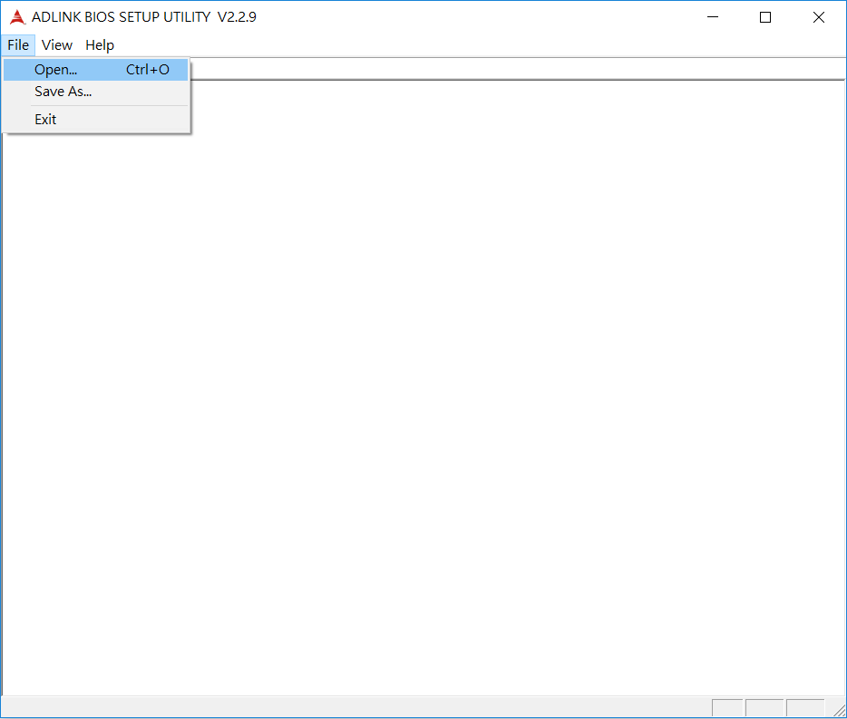
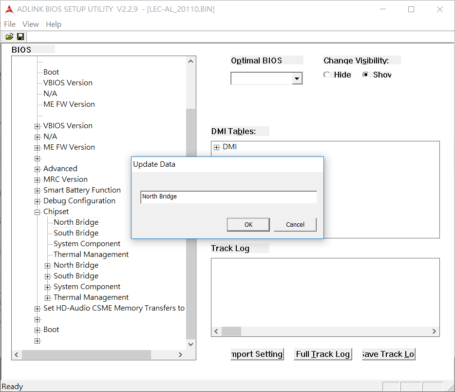
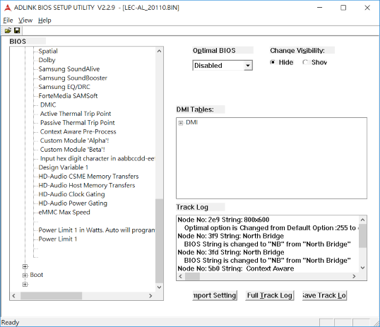

## What is BMT ?

The BIOS Modification Tool allows end users
to modify parameters in the System BIOS without need to recompile the BIOS. All modifications are carried out on the binary file copy of a System BIOS. 

Default values for BIOS setup parameters, visibility of menu items, default boot order, sign-on and setup 
strings, and SMBIOS string data can all be modified with this single tool.<br>The BIOS Modification Tool is a common utility to for all ADLINK's x86 based modules COM/SAMRC/Q7 products. <br>The utility is free to use but will only work on ADLINK enabled BIOS.

## Features
- Rename Menu entries:     Allow you to renew each node or entries
- Hide Menu entries :  hide entries to avoid user from modifying entries or just simplifying the BIOS setup
- Change Defaults :  configure default bootup values to optimize your system 
- Change default boot order :  
- Change DMI Information:  modify logistical DMI data, such as OEM strings
- Track Changes:  save a copy of all items that can be configured.
- Import setting:  import your custom setting copy to restart where you left of

## Supported Operating Systems
The BMT utility is support to run on a host system that supports 

- Windows 7 32-bit / 64-bit

- Windows 10 64-bit

  

## Supported Computer on Modules  (x86 types only)

The BMT utility can be used on the following x86 products with AMI Aptio BIOS


| COM Express     | SMARC   | Q7    | ETX    |
| --------------- | ------- | ----- | ------ |
| Express-CF      | LEC-AL  | Q7-AL | ETX-BT |
| Express-SL2/KL2 | LEC-BW  | Q7-BW |        |
| Express-KL      | LEC-BTS | Q7-BT |        |
| cExpress-KL     | LEC-BT  |       |        |
| Express-SL      |         |       |        |
| cExpress-SL     |         |       |        |
| Express-BL      |         |       |        |
| cExpress-BL     |         |       |        |
| Express-DN7     |         |       |        |
| Express-BD7     |         |       |        |
| cExpress-AL     |         |       |        |
| NanoX-AL        |         |       |        |
| cExpress-BW     |         |       |        |
| cExpress-BT/BT2 |         |       |        |
| NanoX-BT        |         |       |        |


# Getting Started

## How to get the BMT utility

ADLINK's BIOS Utilities are available on GitHub at

```
https://github.com/ADLINK/bios-utility
```

The file to download is a zipped binary, download, unzip it and copy to files to a dedicated directory. There is no need for install, the file can be executed in place simply by double clicking it. 

Note that the utility is only capable of modifying a binary filecopy of the target System BIOS.  After modifying, the binary is saved and than has to be flashed into the target module. 

So most of the below BIOS modification would normally be carried out on a standard laptop or desktop computer. 


###  Basic principle

To modify a BIOS you will go through the following major steps

- Extract the BIOS from a target module and create a file copy 
- Move the file copy to a host machine (or just use the target module for that) and modify the binary file copy with the BMT utility
- Flash the modified BIOS in the target module and test it


###  How to get a binary copy of your target BIOS

Simplest way to get a binary file copy of the BIOS of the target COM this is to run Windows 7/8/10 on the target and extract the module's BIOS with a AMI's AFUWIN utility. 

The AFUWIN module can be downloaded here :

https://ami.com/en/?Aptio_V_AMI_Firmware_Update_Utility.zip

This AFUWIN program can be used to both extract and flash BIOS. 


### 1. Renaming BIOS Setup menu items

​       Allows you to change the name for each node or entries

1. Go to `File` > `open` to load a BIOS ROM file



2. Once loaded successfully, All of entries will be shown.


3. For example, modify the name from “North Bridge” to “NB”



4. After modification, any changes will be highlight and log, then save as new ROM file.


### 2. Change Visibility

​		Allow you to hide / show any entries

1. Select any entry on the left side and change its visibility. For example, to hide “Bluetooth Sideband”.


2. After modification, any changes will be highlight and log, then save as new ROM file.


### 3. Set Default Values

​		Allow you to configure the values for each entries

1. Select any entry on the left side and choose the values as the default on the right drop-list.


2. After modification, any changes will be highlight and log, then save as new ROM file.


### 4. Change DMI Information

​		Allow you to modify DMI data, such BIOS information, System information or to add OEM strings

1. Go to DMI Table and double click which one you would like to configure. For example, “Baseboard or Module Information”:


### 5. Track Changes

​		Allow you to trace any changes you made before.

1. Click “Full track logo” button to see all of changes


2. Click “Save track” button to save as log file.


### 6. Import setting

​		Allow you import your preference without re-configuration

1. Click “Import setting” button to load the change log you stored before.


2. To load the log file on local computer.


3. you will see the history change on the box of Track Log




## How to Flash BIOS[¶](#how-to-flash-bios)

It needs using AMI flash utility to upgrade BIOS, please refer to the following steps:

1. Please go the link of AMI Firmware Update utilities: https://ami.com/en/products/firmware-tools-and-utilities/bios-uefi-utilities/

2. Please download AMI Firmware Update utilities - “Aptio V”


3. Please copy AMI Firmware Update utilities “AfuEfix64.efi” & modified BIOS to USB drive.

4. Please enter BIOS menu and choose “UEFI: Built-in EFI Shell” in Override” to go into BIOS Shell mode.


5. Please enter the following commands to look for the files on USB drive:

```
Shell> fs1:
FS1:\> ls
   10/15/2018  17:31             555,632  AfuEfix64.efi
   10/15/2019 17:30         16,777,216 1012VC0SS60E110.ROM

        2 File(s)  17,332,848 bytes
```


**Note:** you can see the location of USB drive after enter Shell module, ex: fs0 ~ fs3


6. Please enter following command to flash until the utility shows “Process completed”

